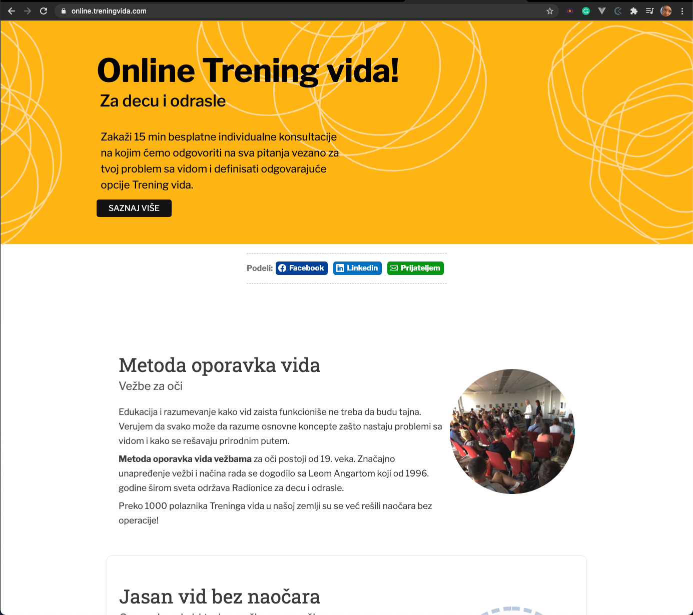

# Landing page 
Online Trening-vida (Serbian local site)

## Building with Responsive Design Replica of the website The Next Web

- Next JS framework JS
- CSS

## Live Demo

[Live Demo Link](https://online.treningvida.com/) running on Vercel

## Getting Started

In this project, we will replicate the archived version of the website The Next Web. The main goal of the project is to apply responsive design techniques so that the website behaves differently depending on the size of the screen where the website is displayed.

## Authors

👤 **Marijan Brvar**

- GitHub: [@githubhandle](https://github.com/marijanbrvar)
- LinkedIn: [LinkedIn](https://linkedin.com/in/mbrvar)

